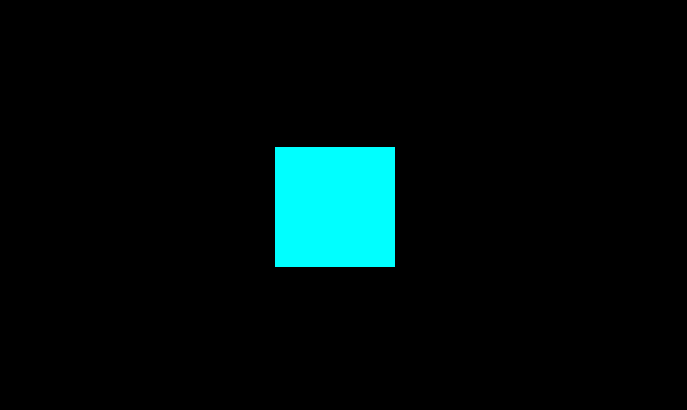
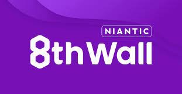

<div class="container">
<h1>3D Web Graphics</h1>
<p>they're heaps fun</p>
<div>
<br/>
<div style="width:16em; height:9em;">
<iframe src="https://www.shadertoy.com/embed/XsBXWt?gui=false&t=0&paused=false&muted=true" allowfullscreen></iframe>
</div>
</div>

---
# Why Go 3D

- Flair
- Visualization
	- Navigation
	- Shopping
	- Architecture
- Metaverse?

---
# Abstraction Layers

</br>
<div class="container">

</div>

1. Mesh
```js
var geometry = new PlaneGeometry( 1, 1 );
var material = new MeshBasicMaterial( { color: "cyan" } );
var mesh = new Mesh( geometry, material );

scene.add( mesh );
```

2. Uniforms & Attributes
	- Uniforms:
		- Per Mesh
		- ie color, position
	- Attributes:
		- Per Vertex
		- ie triangle indices

```js
const vertices = new Float32Array([
//		x,  y,  z
			1,  -1, 0,
			1,  1,  0, 
			-1, -1, 0,
			-1, 1,  0
])

const indices = new Uint16Array([0, 1, 2, 3, 2, 1])
const geometry = new BufferGeometry()
geometry.setAttribute("position", new BufferAttribute(vertices, 3))
geometry.setAttribute("index", new BufferAttribute(indices, 1))
geometry.setIndex(new BufferAttribute(indices, 1))

const material = new MeshBasicMaterial({
  color: 0xff0000,
  side: DoubleSide
})
```

3. Rasterization
	- WebGL


---

# Considerations
- Performance
	- Code
	- People
- Architecture
---


# Frameworks

<div>
</div>
<div class="container row">
<div class="container" style="padding:2em;'">
wasm


</div>
<div class="container" style="padding:2em;'">
js


</div>
<div class="container" style="padding:2em;'">
no-code


</div>
</div>

---

# Frameworks - Unity

- AAA Game engine

| Pros           | Cons               |
| -------------- | ------------------ |
| Intuitive      | Proprietary        |
| Fully Featured | Spaghetti Patterns |
| Native & Web   |                    |

```cs
public class Spinner : MonoBehaviour{	

	public float rotateSpeed = 10;

	void Update() {
			transform.Rotate( rotateSpeed * Time.deltaTime, 0, 0 );
	}
}
```
--- 
# Frameworks - Bevy

- Rust ECS Framework

| Pros         | Cons            |
| ------------ | --------------- |
| Performant   | No Heirachy     |
| Testable     | Strict language |
| Rust is cool | New Framework   |

```rust
struct Rotator { speed: f32 }

fn rotate_system(time: Res<Time>, mut query: Query<(&Rotator, &mut Transform)>) {
	
	for (rotator, mut transform) in &mut query {
		transform.rotate_y(rotator.speed * time.delta_seconds());
	}
}
```
---

# Frameworks - React Three Fiber

- Custom React Renderer
  
| Pros        | Cons                      |
| ----------- | ------------------------- |
| Ecosystem   | Performance - indirection |
| Declarative | Math Verbosity            |
| Debuggable  |                           |

```typescript
function SpinningBox({speed}) {

	const ref = useRef()
	
	useFrame((state, delta) => 
		ref.current.rotation.y += speed * delta)
	
	return (
		<mesh ref={ref}>
			<boxGeometry>
			<meshStandardMaterial/>
		</mesh>
	)
}
```
---

# Creative Coding
<br/>
<iframe src="https://editor.p5js.org/chantey/full/6xro4JN6C"></iframe>

---
# The Future
- Univeral Scene Description
- 

---
# Reference
- [The Coding Train](https://www.youtube.com/c/TheCodingTrain)


<style>
/* marp slide */
section{
	display:flex;
	flex-direction:column;
	width:100%;
	height:100%;
	overflow-y:auto;
	font-size:2em;
}
body::-webkit-scrollbar {
  display: none; /* for Chrome, Safari, and Opera */
}

iframe{
	width:100%;
	height:100%;
	border:none;
}
/* h1, pre{
	align-self:start;
} */

.container{
	display:flex;
	flex-direction:column;
	align-items:center;
	justify-content:center;
	width:100%;
	height:100%;
	&img{
		}
}
img{
	width:90%;
	/* width:5em; */
	/* marg:1em; */
	/* height:5em; */
}

.row{
	flex-direction:row;
}
.half-width{
	width:50%;
}
/* pre{ */
	/* overflow:auto; */
	/* max-height:100%; */
/* } */
code{
	/* font-size:0.5em !important; */
	tab-size:2em;
	/* max-height:10em; */
}


</style>

<style>

pre, code{
	color:#fff8e1;
	background-color:#222d31;
	width:100%;
}
pre{
	--color-prettylights-syntax-comment: #8b949e;
  --color-prettylights-syntax-constant: #79c0ff;
  --color-prettylights-syntax-entity: #d2a8ff;
  --color-prettylights-syntax-storage-modifier-import: #c9d1d9;
  --color-prettylights-syntax-entity-tag: #7ee787;
  --color-prettylights-syntax-keyword: #ff7b72;
  --color-prettylights-syntax-string: #a5d6ff;
  --color-prettylights-syntax-variable: #ffa657;
  --color-prettylights-syntax-brackethighlighter-unmatched: #f85149;
  --color-prettylights-syntax-invalid-illegal-text: #f0f6fc;
  --color-prettylights-syntax-invalid-illegal-bg: #8e1519;
  --color-prettylights-syntax-carriage-return-text: #f0f6fc;
  --color-prettylights-syntax-carriage-return-bg: #b62324;
  --color-prettylights-syntax-string-regexp: #7ee787;
  --color-prettylights-syntax-markup-list: #f2cc60;
  --color-prettylights-syntax-markup-heading: #1f6feb;
  --color-prettylights-syntax-markup-italic: #c9d1d9;
  --color-prettylights-syntax-markup-bold: #c9d1d9;
  --color-prettylights-syntax-markup-deleted-text: #ffdcd7;
  --color-prettylights-syntax-markup-deleted-bg: #67060c;
  --color-prettylights-syntax-markup-inserted-text: #aff5b4;
  --color-prettylights-syntax-markup-inserted-bg: #033a16;
  --color-prettylights-syntax-markup-changed-text: #ffdfb6;
  --color-prettylights-syntax-markup-changed-bg: #5a1e02;
  --color-prettylights-syntax-markup-ignored-text: #c9d1d9;
  --color-prettylights-syntax-markup-ignored-bg: #1158c7;
  --color-prettylights-syntax-meta-diff-range: #d2a8ff;
  --color-prettylights-syntax-brackethighlighter-angle: #8b949e;
  --color-prettylights-syntax-sublimelinter-gutter-mark: #484f58;
  --color-prettylights-syntax-constant-other-reference-link: #a5d6ff;
}

.hljs {
color: var(--color-prettylights-syntax-storage-modifier-import);
}

.hljs-doctag,
.hljs-keyword,
.hljs-meta .hljs-keyword,
.hljs-template-tag,
.hljs-template-variable,
.hljs-type,
.hljs-variable.language_ {
color: var(--color-prettylights-syntax-keyword);
}

.hljs-title,
.hljs-title.class_,
.hljs-title.class_.inherited__,
.hljs-title.function_ {
	text-decoration:auto;
color: var(--color-prettylights-syntax-entity);
}

.hljs-attr,
.hljs-attribute,
.hljs-literal,
.hljs-meta,
.hljs-number,
.hljs-operator,
.hljs-selector-attr,
.hljs-selector-class,
.hljs-selector-id,
.hljs-variable {
color: var(--color-prettylights-syntax-constant);
}

.hljs-string,
.hljs-meta .hljs-string,
.hljs-regexp {
color: var(--color-prettylights-syntax-string);
}

.hljs-built_in,
.hljs-symbol {
color: var(--color-prettylights-syntax-variable);
}

.hljs-code,
.hljs-comment,
.hljs-formula {
color: var(--color-prettylights-syntax-comment);
}

.hljs-name,
.hljs-quote,
.hljs-selector-pseudo,
.hljs-selector-tag {
color: var(--color-prettylights-syntax-entity-tag);
}

.hljs-subst {
color: var(--color-prettylights-syntax-storage-modifier-import);
}

.hljs-section {
font-weight: bold;
color: var(--color-prettylights-syntax-markup-heading);
}

.hljs-bullet {
color: var(--color-prettylights-syntax-markup-list);
}

.hljs-emphasis {
font-style: italic;
color: var(--color-prettylights-syntax-markup-italic);
}

.hljs-strong {
font-weight: bold;
color: var(--color-prettylights-syntax-markup-bold);
}

.hljs-addition {
color: var(--color-prettylights-syntax-markup-inserted-text);
background-color: var(--color-prettylights-syntax-markup-inserted-bg);
}

.hljs-deletion {
color: var(--color-prettylights-syntax-markup-deleted-text);
background-color: var(--color-prettylights-syntax-markup-deleted-bg);
}
</style>