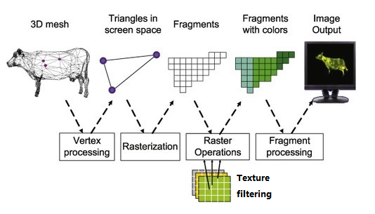

<script type="module" src="https://unpkg.com/@google/model-viewer/dist/model-viewer.min.js"></script>

<div class="container" style="justify-content:center;">
<h1>The 3D Web</h1>
<p>For fun and profit</p>
<div>
<br/>
<div style="width:16em; height:9em;">
<iframe src="https://www.shadertoy.com/embed/XsBXWt?gui=false&t=0&paused=false&muted=true" allowfullscreen></iframe>
</div>
</div>

---
# Why Go 3D
<div class="container row">

<div>

- Function
	- Navigation
	- Shopping
- Flair
	- Marketing
- Fun
	- Creative Coding
	- Games

</div>


<div class="container row" style="width:60%;">
	<div style="padding-right:2em;" class="container col">
	
	
	</div>
	<iframe style="width:60%;" src="https://blobmixer.14islands.com/"></iframe>
</div>
</div>

---

# Hello 3D

<div class="container row">

<div style="width:70%;padding-right:1em;display:flex;flex-direction:column;justify-content:space-between;height:100%;">

- Model Viewer
- HTML only

<div>

```html
<script src="https://unpkg.com/@google/model-viewer/dist/model-viewer.min.js"></script>

<model-viewer src="shared-assets/models/NeilArmstrong.glb"/>
```

</div>

</div>

<div style="width:30%;height:100%;">
<iframe src="https://modelviewer.dev"></iframe>
</div>
</div>

--- 


# Frameworks

<div class="container row">

<div>

Considerations
- Existing stack
	- Language
	- Paradigm
- Requirements
	- Size
	- Speed
	- Artist tooling
</div>

<div class="container row" style="width:50%;height:100%;">
<div class="container col">
wasm


</div>
<div class="container col">
js


</div>
<div class="container col">
no-code


</div>
</div>

---

# Frameworks - Unity
<div class="container row">
<div>

- AAA Game engine
- Pros
	- Easy
	- Fully Features
	- Native & Web
- Cons
	- Spaghetti Code
	- Proprietary
	- Big & Slow load, > 3MB

</div>

<div class="col-right" style="width:60%;">


```cs
public class Spinner : MonoBehaviour{	

	public float rotateSpeed = 10;

	void Update() {
			transform.Rotate( rotateSpeed * Time.deltaTime, 0, 0 );
	}
}
```
</div>
</div>

--- 
# Frameworks - Bevy
<div class="container row">
<div>

- Rust ECS Framework
- Pros
	- Performant
	- Testable
	- Rust is cool
- Cons
	- No Heirachy
	- Strict Language
	- New Framewwork
</div>
<div class="col-right" style="width:60%;">


```rust
struct Rotator { speed: f32 }

fn rotate_system(
	time: Res<Time>, 
	mut query: Query<(&Rotator, &mut Transform)>
	) {
	
	for (rotator, mut transform) in &mut query {
		transform.rotate_y(rotator.speed * time.delta_seconds());
	}
}
```
</div>
</div>

---

# Frameworks - React Three Fiber

<div class="container row">
<div>

- Custom React Renderer
- Pros
	- Tiny ~150KB
	- Declarative JSX
	- Ecosystem
- Cons
	- Unconventional
	- Math verbosity
	- native?

</div>
<div class="col-right" style="width:60%;">


```typescript
function SpinningBox({speed}) {

	const ref = useRef()
	
	useFrame((state, delta) => 
		ref.current.rotation.y += speed * delta)
	
	return (
		<mesh ref={ref}>
			<boxGeometry>
			<meshStandardMaterial/>
		</mesh>
	)
}
```
</div>

</div>


---

# Next Steps

<div class="container row">

- Creative Coding
	- p5.js
- Games
	- GitHub GameOff
		- Ends 02/12/22
<iframe style="width:50%;" src="https://editor.p5js.org/chantey/full/6xro4JN6C"></iframe>
</div>


---
# Observations

- Embedded 3D
	- GLTF Extensions, USD
	- The Myspace problem
	- 3D tabs, iframes?
- UX challenges
- Tech
	- WebXR, WebGPU
	- Native, web, hybrid?

---
# Reference
- [The Coding Train](https://www.youtube.com/c/TheCodingTrain)
- [WebGL2 Fundamentals](https://webgl2fundamentals.org/)

---

# How It Works
<div class="container row">

<div>

- WebGL
	- *Rasterization* Engine
	- Vertex & Fragment shaders
</div>


</div>

</div>

---
# How It Works

```js
const vertices = new Float32Array([
//		x,  y,  z
			1,  -1, 0,
			1,  1,  0, 
			-1, -1, 0,
			-1, 1,  0
])

const indices = new Uint16Array([0, 1, 2, 3, 2, 1])
const geometry = new BufferGeometry()
geometry.setAttribute("position", new BufferAttribute(vertices, 3))
geometry.setAttribute("index", new BufferAttribute(indices, 1))
geometry.setIndex(new BufferAttribute(indices, 1))

const material = new MeshBasicMaterial({
  color: 0xff0000,
  side: DoubleSide
})
```

---
# How It Works

```javascript
  var vertexShader = createShader(gl, gl.VERTEX_SHADER, vertexShaderSource);
  var fragmentShader = createShader(gl, gl.FRAGMENT_SHADER, fragmentShaderSource);
  var program = createProgram(gl, vertexShader, fragmentShader);
  var positionAttributeLocation = gl.getAttribLocation(program, "a_position");
  var positionBuffer = gl.createBuffer();
  gl.bindBuffer(gl.ARRAY_BUFFER, positionBuffer);
  var positions = [
    0, 0,
    0, 0.5,
    0.7, 0,
  ];
  gl.bufferData(gl.ARRAY_BUFFER, new Float32Array(positions), gl.STATIC_DRAW);
  var vao = gl.createVertexArray();
  gl.bindVertexArray(vao);
  gl.enableVertexAttribArray(positionAttributeLocation);
  var size = 2;
  var type = gl.FLOAT;
  var normalize = false;
  var stride = 0;
  gl.vertexAttribPointer(positionAttributeLocation, size, type, normalize, stride, offset);
  gl.viewport(0, 0, gl.canvas.width, gl.canvas.height);
  gl.clearColor(0, 0, 0, 0);
  gl.clear(gl.COLOR_BUFFER_BIT);
  gl.useProgram(program);
  gl.bindVertexArray(vao);
  var primitiveType = gl.TRIANGLES;
  var offset = 0;
  var count = 3;
  gl.drawArrays(primitiveType, offset, count);

```


<style>
/* marp slide */


section{
	display:flex;
	flex-direction:column;
	width:100%;
	height:100%;
	overflow-y:auto;
	font-size:1.6em;
}
body::-webkit-scrollbar {
  display: none; /* for Chrome, Safari, and Opera */
}

iframe{
	width:100%;
	/* min-height:50vh; */
	height:100%;
	border:none;
}
/* h1, pre{
	align-self:start;
} */
.col-left{
	display:flex;
	flex-direction:column;
	align-items:flex-start;
	justify-content:space-between;
}
.col-right{
	padding-top:1em;
	display:flex;
	flex-direction:column;
	align-items:flex-end;
	justify-content:space-between;
}
.container{
	display:flex;
	flex-direction:column;
	align-items:center;
	justify-content:space-between;
	width:100%;
	height:100%;
	&img{
		}
}
img{
	width:90%;
	/* width:5em; */
	/* marg:1em; */
	/* height:5em; */
}

.row{
	flex-direction:row;
	align-items:start;
}
.col{
	justify-content:start; 
	gap:1em;
	padding-top:2em;
}
.half-width{
	width:50%;
}
/* pre{ */
	/* overflow:auto; */
	/* max-height:100%; */
/* } */
code{
	/* font-size:0.5em !important; */
	tab-size:2em;
	/* max-height:10em; */
}


</style>

<style>

pre, code{
	color:#fff8e1;
	background-color:#222d31;
	width:100%;
}
pre{
	--color-prettylights-syntax-comment: #8b949e;
  --color-prettylights-syntax-constant: #79c0ff;
  --color-prettylights-syntax-entity: #d2a8ff;
  --color-prettylights-syntax-storage-modifier-import: #c9d1d9;
  --color-prettylights-syntax-entity-tag: #7ee787;
  --color-prettylights-syntax-keyword: #ff7b72;
  --color-prettylights-syntax-string: #a5d6ff;
  --color-prettylights-syntax-variable: #ffa657;
  --color-prettylights-syntax-brackethighlighter-unmatched: #f85149;
  --color-prettylights-syntax-invalid-illegal-text: #f0f6fc;
  --color-prettylights-syntax-invalid-illegal-bg: #8e1519;
  --color-prettylights-syntax-carriage-return-text: #f0f6fc;
  --color-prettylights-syntax-carriage-return-bg: #b62324;
  --color-prettylights-syntax-string-regexp: #7ee787;
  --color-prettylights-syntax-markup-list: #f2cc60;
  --color-prettylights-syntax-markup-heading: #1f6feb;
  --color-prettylights-syntax-markup-italic: #c9d1d9;
  --color-prettylights-syntax-markup-bold: #c9d1d9;
  --color-prettylights-syntax-markup-deleted-text: #ffdcd7;
  --color-prettylights-syntax-markup-deleted-bg: #67060c;
  --color-prettylights-syntax-markup-inserted-text: #aff5b4;
  --color-prettylights-syntax-markup-inserted-bg: #033a16;
  --color-prettylights-syntax-markup-changed-text: #ffdfb6;
  --color-prettylights-syntax-markup-changed-bg: #5a1e02;
  --color-prettylights-syntax-markup-ignored-text: #c9d1d9;
  --color-prettylights-syntax-markup-ignored-bg: #1158c7;
  --color-prettylights-syntax-meta-diff-range: #d2a8ff;
  --color-prettylights-syntax-brackethighlighter-angle: #8b949e;
  --color-prettylights-syntax-sublimelinter-gutter-mark: #484f58;
  --color-prettylights-syntax-constant-other-reference-link: #a5d6ff;
}

.hljs {
color: var(--color-prettylights-syntax-storage-modifier-import);
}

.hljs-doctag,
.hljs-keyword,
.hljs-meta .hljs-keyword,
.hljs-template-tag,
.hljs-template-variable,
.hljs-type,
.hljs-variable.language_ {
color: var(--color-prettylights-syntax-keyword);
}

.hljs-title,
.hljs-title.class_,
.hljs-title.class_.inherited__,
.hljs-title.function_ {
	text-decoration:auto;
color: var(--color-prettylights-syntax-entity);
}

.hljs-attr,
.hljs-attribute,
.hljs-literal,
.hljs-meta,
.hljs-number,
.hljs-operator,
.hljs-selector-attr,
.hljs-selector-class,
.hljs-selector-id,
.hljs-variable {
color: var(--color-prettylights-syntax-constant);
}

.hljs-string,
.hljs-meta .hljs-string,
.hljs-regexp {
color: var(--color-prettylights-syntax-string);
}

.hljs-built_in,
.hljs-symbol {
color: var(--color-prettylights-syntax-variable);
}

.hljs-code,
.hljs-comment,
.hljs-formula {
color: var(--color-prettylights-syntax-comment);
}

.hljs-name,
.hljs-quote,
.hljs-selector-pseudo,
.hljs-selector-tag {
color: var(--color-prettylights-syntax-entity-tag);
}

.hljs-subst {
color: var(--color-prettylights-syntax-storage-modifier-import);
}

.hljs-section {
font-weight: bold;
color: var(--color-prettylights-syntax-markup-heading);
}

.hljs-bullet {
color: var(--color-prettylights-syntax-markup-list);
}

.hljs-emphasis {
font-style: italic;
color: var(--color-prettylights-syntax-markup-italic);
}

.hljs-strong {
font-weight: bold;
color: var(--color-prettylights-syntax-markup-bold);
}

.hljs-addition {
color: var(--color-prettylights-syntax-markup-inserted-text);
background-color: var(--color-prettylights-syntax-markup-inserted-bg);
}

.hljs-deletion {
color: var(--color-prettylights-syntax-markup-deleted-text);
background-color: var(--color-prettylights-syntax-markup-deleted-bg);
}
</style>